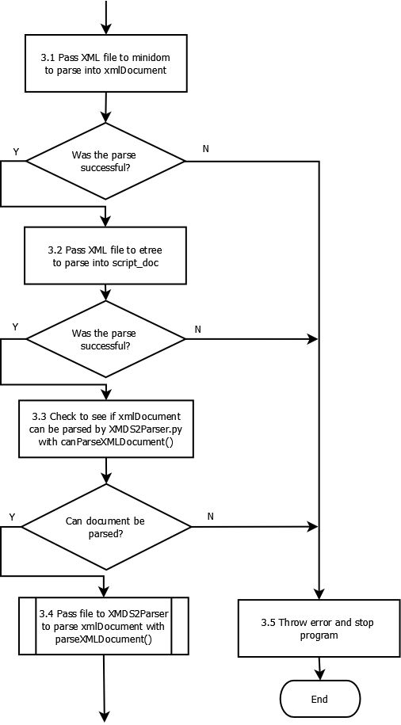

.. _DeveloperDocumentation:

Developer Documentation
=======================

Developers need to know more than users.  For example, they need to know about the test suite, and writing test cases.  They need to know how to perform a developer installation.  They need to know how to edit and compile this documentation.  They need a step-by-step release process.

.. index:: Test scripts

.. _TestScripts:

Test scripts
------------

Every time you add a new feature and/or fix a new and exciting bug, it is a great idea to make sure that the new feature works and/or the bug stays fixed.  Fortunately, it is pleasantly easy to add a test case to the testing suite.

1. Write normal XMDS script that behaves as you expect.
2. Add a ``<testing>`` element to your script.  You can read the description of this element and its contents below, and have a look at other testcases for examples, but the basic structure is simple:.

.. parsed-literal::

      <:ref:`testing <TestingElement>`> 
        <:ref:`command_line <CommandLineElement>`> <:ref:`/command_line <CommandLineElement>`>
        <:ref:`arguments <ArgumentsElement>`>
          <:ref:`argument <ArgumentElement>` />
          <:ref:`argument <ArgumentElement>` />
          ...
        <:ref:`/arguments <ArgumentsElement>`>
        <:ref:`input_xsil_file <InputXSILFileElement>` />
        <:ref:`xsil_file <XSILFileElement>`>
          <:ref:`moment_group <MomentGroupElement>` />
          <:ref:`moment_group <MomentGroupElement>` />
          ...
        <:ref:`/xsil_file <XSILFileElement>`>
      <:ref:`/testing <TestingElement>`>
      
3. Put into the appropriate ``testsuite/`` directory.
4. run ``./run_tests.py`` This will automatically generate your ``_expected`` files.
5. Commit the ``.xmds``, ``*_expected.xsil`` file and any ``*_expected*`` data files.
  
.. _TestingElement:

Testing element
~~~~~~~~~~~~~~~

.. _CommandLineElement:

command_line element
~~~~~~~~~~~~~~~~~~~~

.. _InputXSILFileElement:

input_xsil_file element
~~~~~~~~~~~~~~~~~~~~~~~

.. _XSILFileElement:

xsil_file element
~~~~~~~~~~~~~~~~~

.. _MomentGroupElement:

moment_group element
~~~~~~~~~~~~~~~~~~~~

.. index:: Documentation format

.. _UserDocumentation:

XMDS Documentation
------------------

.. Author: Justin Lewer, 2013.

Documentation in XMDS is written as reStructuredText files (.rst), which are then parsed into HTML files to be displayed on their website. 

You can find the user documentation folder located ``admin/userdoc-source``. This is where all of the .rst files are kept. If you’re wanting to add documentation to the site, you’ll need to create your own .rst file, with the name of the webpage as the filename.

RST is a relatively simple language, which is basically simplified HTML markup. For documentation on how to make Lists, Href Links, Embed images etc, you should check here;

http://docutils.sourceforge.net/docs/user/rst/quickref.html
http://docutils.sourceforge.net/docs/ref/rst/restructuredtext.html

However, you should easily be able to use some of the pre-existing .rst files in the project as a template to create yours.

Once your documentation is in this folder, it should be deployed along with the project to their website when you run create_release_version.sh, which can be found in the /Trunk/xpdeint/admin folder. If you would like to test to see what your rst file generates without running this shell script, you can use the Makefile in the userdoc-source folder, by running “make html”.

NOTE: Before you can run the create_release_version.sh file, there are a few packages you will need. This command uses latex to generate the XMDS2 pdf, so you’ll be needing the following packages; ``texlive-fonts-recommended``, ``texlive-lang-cjk``, ``texlive-latex-base``.

.. index:: XML schema updates

.. _HowToAddElementToValidator:

How to update ``XMDS2`` script validator (XML schema)
-------------------------------------------------------

.. Author: Damien Beard. 2013.

This is a short guide to adding an element to XMDS2, so that it can be validated by the XMDS2 script validator. In this guide, the example being used will be the addition of a matrix element to the validator.  The matrix will have a  ‘name’ and a ‘type’ (so it can be called later, and the type is known for future reference). Each matrix will also need a ‘row’ component, and possibly an initialisation value.

Navigate to ``xpdeint/support/xpdeint.rnc``. This is a RelaxNG compact file, which specifies the XML schema which is only used for issuing warnings to users about missing or extraneous XML tags / attributes. Add the following lines to the end of the file (so that it is outside all other brackets in the file):

.. code-block:: none
    
    Matrix = element matrix {
        attribute name { text }
        , attribute type { text }?
        , element components { text }
        , element initialisation {
            attribute kind { text }?
        }?
    }

Save this file, and then in the terminal navigate to the folder ``xpdeint/support/`` and run ``make``. This updates the XML based file ``xpdeint/support/xpdeint.rng``, which is the file the parser uses to validate elements in XMDS2. This file which is  used is in RelaxNG format, but RelaxNG compact is easier to read and edit.

Commit both ``xpdeint/support/xpdeint.rnc`` and ``xpdeint/support/xpdeint.rng`` to the code repository.

.. index:: Adding an integrator

.. _HowToAddIntegrator:

How to introduce a new integrator Stepper into the XMDS2 environment
--------------------------------------------------------------------

.. Author: Damien Beard. 2013.

This is a short guide to adding a new stepper containing a new mathematical technique to XMDS2, which can then be used by to integrate equations. This guide describes the logistics of introducing a new stepper and as such, the code inside the stepper template is outside the scope of this document. The new stepper which will be used in this guide will be called ‘IntegrateMethodStepper’.

Navigate to the ``xpdeint/Segments/Integrators`` directory. Create a file called ``IntegrateMethodStepper.tmpl`` in this directory. In this file, implement the new integration algorithm (follow the convention of existing steppers in that folder). In this same folder, open the file named ``__init__.py`` and add the following line to the bottom of the file and save it:

.. code-block:: none

    import IntegrateMethodStepper

Navigate up until you are in the ``xpdeint`` directory. Open the file ``XMDS2Parser.py``, and 'find' the algorithm map (Ctrl+F > algorithmMap works for most text editors). The mnemonic ‘IM’ will be used for our Stepper. If the stepper uses fixed step sizes, then add the following line to the algorithm map:

.. code-block:: none

    'IM':   (Integrators.FixedStep.FixedStep, Integrators.IntegrateMethodStepper.IntegrateMethodStepper),

Otherwise, if your stepper is an adaptive Stepper, add the following line:

.. code-block:: none

    'IM':   (Integrators.AdaptiveStep.AdaptiveStep, Integrators.IntegrateMethodStepper.IntegrateMethodStepper),

In the terminal, navigate to the ``xpdeint`` directory, and run make over the entire directory. 'IM' can now be used to specify the new Stepper as your integration algorithm inside your .xmds files, e.g.

.. code-block:: xpdeint

    <integrate algorithm="IM" interval="5.0" steps="2000">
        ...
    </integrate>

.. _LogicalBreakDownParsingProcess:

.. index:: XMDS2 parsing process

Logical breakdown of XMDS2 Parsing Process
------------------------------------------

.. Author: Damien Beard. 2013.

The following information is intended to assist developers in understanding the logical process undertaken by the XMDS2 system when parsing an .xmds file. The documentation was not designed to be exhaustive, but rather to help paint a picture of part of the way XMDS2 works. 

The flowcharts have been created in open source diagram drawing program Dia, and compiled into .png files which are displayed below. This page contains links to the original .dia files, so if you find any error in the information below (or you'd like to extend it, by adding in more information), please update the .dia files and commit them (and their compiled versions) to svn. 

Overall process for parsing XML file in XMDS2
~~~~~~~~~~~~~~~~~~~~~~~~~~~~~~~~~~~~~~~~~~~~~

The original .dia file can be downloaded `here <_images/Overall_Flowchart.dia>`__.

parser2.py parses XML file (Sub process 3)
~~~~~~~~~~~~~~~~~~~~~~~~~~~~~~~~~~~~~~~~~~

You can download the original dia file `here <_images/Subprocess3_ParsingXMLFile.dia>`__.

Pass file to XMDS2Parser to parse xmlDocument with parseXMLDocument() (Sub process 3.4)
~~~~~~~~~~~~~~~~~~~~~~~~~~~~~~~~~~~~~~~~~~~~~~~~~~~~~~~~~~~~~~~~~~~~~~~~~~~~~~~~~~~~~~~

You can download the original dia file `here <_images/Subprocess3_4_parseXMLDocument.dia>`__.

Parse Top Level Sequence elements (Sub process 3.4.11)
~~~~~~~~~~~~~~~~~~~~~~~~~~~~~~~~~~~~~~~~~~~~~~~~~~~~~~

You can download the original dia file `here <_images/Subprocess3_4_11_ParseTopLvlSeqElements.dia>`__.

Parse Integrate Element (Sub process 3.4.11.2)
~~~~~~~~~~~~~~~~~~~~~~~~~~~~~~~~~~~~~~~~~~~~~~

You can download the original dia file `here <_images/Subprocess3_4_11_2_ParseIntegrateElement.dia>`__.

.. index:: XMDS2 project directory layout

Directory layout
----------------

XMDS2's code and templates
~~~~~~~~~~~~~~~~~~~~~~~~~~

All ``.tmpl`` files are Cheetah template files.  These are used to generate C++ code.  These templates are compiled as part of the XMDS2 build process to ``.py`` files of the same name.  Do not edit the generated ``.py`` files, always edit the ``.tmpl`` files and regenerate the corresponding ``.py`` files with ``make``.

* ``xpdeint/``: 
	* ``Features/``: Code for all ``<feature>`` elements, such as ``<globals>`` and ``<auto_vectorise>``
		* ``Transforms/``: Code for the Fourier and matrix-based transforms (including MPI variants).
	* ``Geometry/``: Code for describing the geometry of simulation dimensions and domains.  Includes code for ``Geometry``, ``Field`` and all ``DimensionRepresentations``.
	* ``Operators/``: Code for all ``<operator>`` elements, including ``IP``, ``EX`` and the temporal derivative operator ``DeltaA``.
	* ``Segments/``: Code for all elements that can appear in a ``<segments>`` tag.  This includes ``<integrate>``, ``<filter>``, and ``<breakpoint>``.
		* ``Integrators``: Code for fixed and adaptive integration schemes, and all steppers (e.g. ``RK4``, ``RK45``, ``RK9``, etc.)
	* ``Stochastic/``: Code for all random number generators and the random variables derived from them.
		* ``Generators/``: Code for random number generators, includes ``dSFMT``, ``POSIX``, ``Solirte``.
		* ``RandomVariables/``: Code for the random variables derived from the random number generators.  These are the gaussian, poissonian and uniform random variables.
	* ``SimulationDrivers/``: Code for all ``<driver>`` elements.  In particular, this is where the location of MPI and multi-path code.
	* ``Vectors/``: Code for all ``<vector>`` elements, and their initialisation.  This includes normal ``<vector>`` elements as well as ``<computed_vector>`` and ``<noise_vector>`` elements.
	* ``includes/``: C++ header and sources files used by the generated simulations.
	* ``support/``: Support files
		* ``wscript``: ``waf`` build script for configuring and compiling generated simulations
		* ``xpdeint.rnc``: Compact RelaxNG XML validation for XMDS scripts.  This is the source file for the XML RelaxNG file ``xpdeint.rng``
		* ``xpdeint.rng``: RelaxNG XML validation for XMDS scripts.  To regenerate this file from ``xpdeint.rnc``, just run ``make`` in this directory.
	* ``waf/``: Our included version of the Python configuration and build tool ``waf``.
	* ``waf_extensions/``: ``waf`` tool for compiling Cheetah templates.
	* ``xsil2graphics2/``: Templates for the output formats supported by ``xsil2graphics2``.
	* ``wscript``: ``waf`` build script for XMDS2 itself.
	* ``CodeParser.py``: Minimally parses included C++ code for handling nonlocal dimension access, IP/EX operators and IP operator validation.
	* ``Configuration.py``: Manages configuration and building of generated simulations.
	* ``FriendlyPlusStyle.py``: Sphinx plug-in to improve formatting of XMDS scripts in user documentation.
	* This directory also contains code for the input script parser, code blocks, code indentation, and the root ``_ScriptElement`` class.

Support files
~~~~~~~~~~~~~

* ``admin/``: Documentation source, Linux installer and release scripts.
	* ``developer-doc-source/``: source for epydoc python class documentation (generated from python code).
	* ``userdoc-source/``: source for the user documentation (results visible at www.xmds.org and xmds2.readthedocs.org).
	* ``xpdeint.tmbundle/``: TextMate support bundle for Cheetah templates and XMDS scripts
* ``bin/``: Executable scripts to be installed as part of XMDS2 (includes ``xmds2`` and ``xsil2graphics2``).
* ``examples/``: Example XMDS2 input scripts demonstrating most of XMDS2's features.
* ``testsuite/``: Testsuite of XMDS2 scripts.  Run the testsuite by executing ``./run_tests.py``
